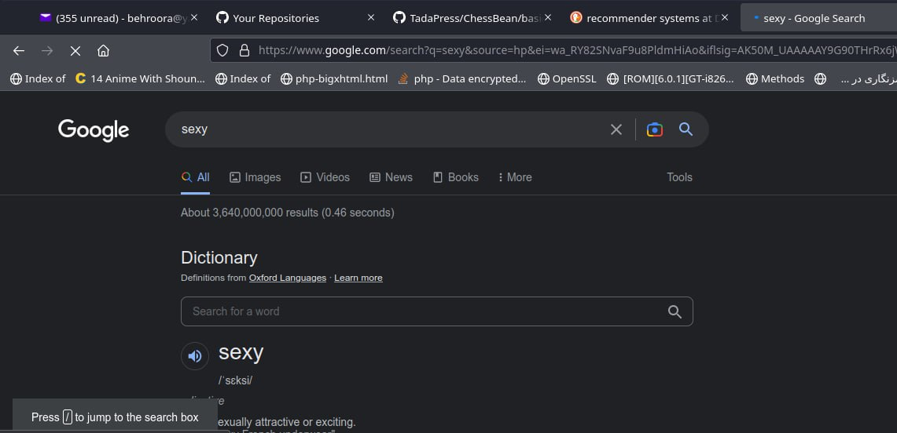
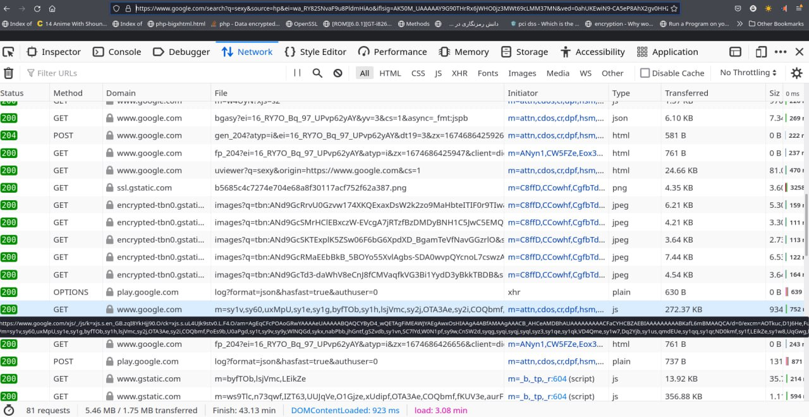
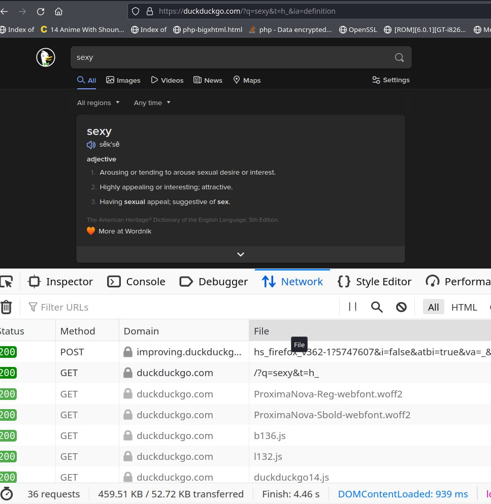

# Which Search Engine Should We Use?

You've probably heard people in the privacy field repeatedly express that if you use Google or similar search engines, you should switch to DuckDuckGo and others. But how much can this statement really impact privacy and security?

In this article, we'll discuss this topic briefly.

It has been years since I first tried DuckDuckGo. At first, it had a plain white theme, and its query responses were very basic for beginners.

In the field of Information Retrieval (IR) and Recommender Systems (RS), we refer to this as the "Cold Start" issue.

Note 1: IR stands for Information Retrieval, and RS stands for Recommender Systems. These are scientific topics that discusses the underlying mechanisms of search engines.

ُThe DuckDuckGo was great:
https://duckduckgo.com
But it wasn't a proper search engine, couldn't satisfy the query, specially in Persian Language.

Then, after a few years, folks at the Iranian government here blocked the whole website on firewall. Lately, with the poisoning of DNS servers, they bypassed all the requests on Safe Search and unblocked the website.

Nowadays, the query results have significantly improved, and it has overcome the Cold Start issue. ✅

____________________________________

DuckDuckGo claims to be secure, but how true is this statement? We can measure it using our basic network knowledge.

I send a search query for Google and we study what information Google encapsulates in the HTTP headers and sends to its servers. Later, we repeat the same query in DuckDuckGo and test what happens there.

In Google:



What we see is a simple search... but further investigation will make it more complicated:

1. Information encapsulated in the header URL as GET:

Includes:

`https://www.google.com/search?q=sexy&source=hp&ei=wa_RY82SNvaF9u8PldmHiAo&iflsig=AK50M_UAAAAAY9G90THrRx6jWHO0jz3MWt69cLMM37MN&ved=0ahUKEwiN9-CA5eP8AhX2gv0HHZXsAaEQ4dUDCAc&uact=5&oq=sexy&gs_lcp=Cgdnd3Mtd2l6EAMyBQgAEIAEMgUIABCABDIFCAAQgAQyBQgAEIAEMgUILhCABDIFCC4QgAQyBQguEIAEMgUIABCABDIFCAAQgAQyBQgAEIAEOgsILhCABBDHARDRAzoICC4QgAQQ1AJQAFjuC2DTlwFoAXAAeACAAcACiAHdCJIBBTItMi4ymAEAoAEB&sclient=gws-wiz‍‍`


1- Query Parameter:
`q=sexy`


2- Source Parameter:
`source=hp`


This is where you submitted the query, here "hp" stands for home page. It informs the server that this person has opened our website and performed a search on it's home-page. It didn't come from a browser URL-bar or a plugin or anything else.


3- EI Parameter:
`ei=wa_RY82SNvaF9u8PldmHiAo`


Now slowly suspicious parameters are appearing:)) This "ei" is a timestamp, the exact time when you made the search... encoded in a way! It even includes milliseconds according to the old tales!
I will decode it for you, and share the link of the article which explains decoding this parameter along with its source code later in this document:
```php
var_dump(
    time(),
    ei_decode("wa_RY82SNvaF9u8PldmHiAo")
);
```

```
int(1674687414)array(4) {
  [0]=>
  int(1670492097)
  [1]=>
  int(887117)
  [2]=>
  int(4261249782)
  [3]=>
  int(2701257877)
}
```

As you can see, compared to the current timestamp -- that I'm writing this article --, it is completely logical...
And what are the other parameters?! Milliseconds? Delay? Typing speed of my fingers?! What are they really???
Ask Google, not me...
If you want a clarified document about all of these, you should ask Google for it...

4- iflsig parameter 

`iflsig=AK50M_UAAAAAY9G90THrRx6jWHO0jz3MWt69cLMM37MN`

What is this?
Honestly, I don't account for all Google's movements under the hood of browser, and the further we go, the more suspicious the situation becomes. But I heard from someone that this parameter, "iflsig", is a kind of trick to counteract the CSRF mechanism in order to resolve redirect notices. It's a token that expires after a few minutes... But for more details, ask Google :)
Note 2: I explained CSRF and its family somewhere before, I'll find it and make an article about it and put it here... (XEDIT)


5- ved parameter

`ved=0ahUKEwiN9-CA5eP8AhX2gv0HHZXsAaEQ4dUDCAc`

This is one of the scariest parameters and it's about how the link was clicked...
It contains five sub-parameters itself:
The first sub-parameter indicates where the link was on the page,
The second sub-parameter indicates the type of the link,
The third sub-parameter... indicates the search result page...
I won't explain further, please read it yourself from this page:

https://moz.com/blog/inside-googles-ved-parameter


6- uact parameter
`uact=5`


7- oq parameter
`oq=sexy`


8- gs_lcp parameter
`gs_lcp=Cgdnd3Mtd2l6EAMyBQgAEIAEMgUIABCABDIFCAAQgAQyBQgAEIAEMgUILhCABDIFCC4QgAQyBQguEIAEMgUIABCABDIFCAAQgAQyBQgAEIAEOgsILhCABBDHARDRAzoICC4QgAQQ1AJQAFjuC2DTlwFoAXAAeACAAcACiAHdCJIBBTItMi4ymAEAoAEB`


9- sclient parameter
`sclient=gws-wiz`

From all these last four parameters, I'm only familiar with "oq", which stands for Original Query... meaning the thing you first searched for... (you might change it later)
I don't know the rest.
The rumor is that important information is hidden in mention parameters, encoded/encrypted in a way and sent to the server... but Google doesn't talk about them...

Well mates, alllll of these were just URL header!!! We only analyzed the parameters sending over the GET method...

And as lovers of HTTP and fans of Professor Berners-Lee, we know that GET has a byte-size limitation in data transmission, only 8 kilobytes are allowed in whole GET block, which means 8192 bytes, i.e. 8192 characters...

So, Google obviously doesn't place main/crutial information over GET, because of the limitation. 
So in that case where does it really send them?
In the POST header?!

Let's see what was encapsulated in this search scenario, in HTTP POST header:



Generally, as far as I can see, there have been 81 GET/POST requests sent and recieved *-*
It's quit normal to have multiple requests sent and recieved, because HTTP is stateless...but having 81 of them, for a simple text-based search... is that normal?!

So what is encapsulated in those POSTs?!
I cannot examine all of them, but for example, look at the second one:

POST

`https://www.google.com/gen_204?atyp=i&ei=wa_RY82SNvaF9u8PldmHiAo&ct=slh&v=t1&im=M&pv=0.9109014057876286&me=12:1674686414028,V,0,0,0,0:1029,h,1,1,o:2121,h,1,1,i:532,h,1,1,o:12,h,1,1,i:475,h,1,1,o:3,h,1,1,i:9,h,1,1,o:3,h,1,1,i:102,h,1,1,o:7,h,1,1,i:396,V,0,0,1920,456:126,R,1,1,0,0,1908,456:0,G,1,1,1000,188:26,V,0,0,1920,456,1:0,R,1,1,0,0,1908,456:1077,B,659:3402,e,H&zx=1674686423348`

What do these mean? 
Ask Google.

But here is the important part. If you click on a link in Google results, you **won't** be directly redirected to that link, instead, you will first be redirected to Google's server, where some information about when and where you clicked on which link with what session is recorded in Google's database, then, the server redirects you to the link's original destination.
So, if I want to click on one of the results, the hyperlink that redirects me doesn't directly go to the desired document. Instead, it first goes to Google's server, which tells it how much time the person who searched for it spent, scrolled, and at what speed they clicked on that particular result:))

How does it work? Like this:

`https://www.google.com/url?sa=t&rct=j&q=&esrc=s&source=web&cd=&cad=rja&uact=8&ved=2ahUKEwjzhvCK5eP8AhWv_rsIHT6PDWkQFnoECBgQAQ&url=https%3A%2F%2Fwww.merriam-webster.com%2Fdictionary%2Fsexy&usg=AOvVaw036M2DCas1W3nQB6UEeT4n`


I leave the analysis up to you *-* 

Now I want to repeat this same search with DuckDuckGo,
Check it out, 25 requests were sent and recieved... That's about 1/3 of Google's requests:



Check the URL header!

`https://duckduckgo.com/?q=sexy&t=h_&ia=definition`


1- Query parameter
`q=sexy`

2- t parameter
`t=h_`

Probably shows the source -> homepage

3- ia parameter
`ia=definition`

Since it retrieves the definition of the query word... I think if we don't have a definition, it can be:
`ia=web`

These are the only three things that are encapsulated in GET...

Of course, there is more information in his POSTs, but you can check them out yourself.

____________________________________

The next important issue is that, unlike Google or other suspicious search engines, Hyperlinks goes directly to the result without leaving a *log* in some place:)

So far, we can understand how true the DuckDuckGo's claim is✅

As someone who has previously coded a search engine and as a person familiar with its implementation, I know that solving the Cold Start problem is very difficult, and consequently, if you don't want to intentionally gather information, the quality of your system and services will go down because you have no knowledge of the user.

Google's services are so good because it knows you better than you know yourself. It is a commercial company, and we don't expect privacy and anonymity from it, but if you care about security, privacy, and anonymity (which I may later explain why it is important in a set of articles), it is better to start by replacing your search engine...

Now DuckDuckGo has adopted some interesting mechanisms, For example, it proxies other search engines itself and puts itself in the middle, without revealing your identity to them. With these moves, it can greatly improve its shortcomings compared to Google... But it probably can't improve it too much because then you have the right to doubt how it became so good if it didn't take the path of other suspicious search engines:))

If you are interested in the underlying technology of DuckDuckGo:

https://github.com/duckduckgo 

Code:

https://deedpolloffice.com/blog/articles/decoding-ei-parameter

```php
function ei_decode($ei)
{
    // Copyright 2013 Deed Poll Office Ltd, UK <https://deedpolloffice.com>
    // Licensed under Apache Licence v2.0 <http://apache.org/licenses/LICENSE-2.0>
    $ei = base64_decode(str_replace(array('_', '-'), array('+', '/'), $ei));
    if (!preg_match('/^
        (.{4})
        ((?:[\x80-\xff]*[\0-\x7f])+)
        $/sx', $ei, $matches)) return false; // Non-valid ei value
    $ret = array();
    $val = 0;
    foreach (str_split($matches[1]) as $i => $c)
        $val = PHP_INT_SIZE < 5 && function_exists('bcadd') ?
            bcadd($val, bcmul(ord($c), bcpow(2, $i * 8))) :
            $val + (ord($c) << $i * 8);
    $ret[0] = $val;
    preg_match_all('/[\x80-\xff]*[\0-\x7f]/', $matches[2], $matches, PREG_SET_ORDER);
    foreach ($matches as $j => $match) {
        $val = 0;
        foreach (str_split($match[0]) as $i => $c)
            $val = PHP_INT_SIZE < 8 && function_exists('bcadd') ?
                bcadd($val, bcmul(ord($c) & 0x7f, bcpow(2, $i * 7))) :
                $val + ((ord($c) & 0x7f) << $i * 7);
        $ret[$j + 1] = $val;
    }
    return $ret;
}
```

## Copyright:

This is a free and open-source article under the license of GFDL1-3, so permission is granted to copy, distribute and/or modify this document under the terms of the GNU Free Documentation License.

## Refrences:

* https://github.com/duckduckgo
* https://help.duckduckgo.com/privacy/t/
* https://help.duckduckgo.com/duckduckgo-help-pages/settings/params/
* http://stackoverflow.com/questions/2659952/ddg#2659995
* https://stackoverflow.com/questions/69660435/what-are-the-components-of-a-google-com-url-string
* https://stackoverflow.com/questions/70866734/what-does-the-ved-parameter-in-a-google-search-refer-to
* https://cs50.stackexchange.com/questions/38839/cs50w-project-0-im-feeling-lucky
* https://deedpolloffice.com/blog/articles/decoding-ei-parameter
* https://stackoverflow.com/questions/18584386/what-does-ei-mean-in-the-google-homepage-url-https-www-google-co-in-gws-rd#20753179 
