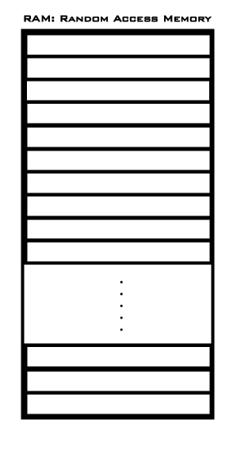

# Comparison of RAM and HDD Read/Write Speeds

## Abstract

This article provides a detailed comparison of the speed at which data is read and written on RAM and a hard disk drive (HDD). The underlying technology of both RAM and HDD is explained, followed by a comparison of their average read/write speeds considering technological complexities.

In this article, I will discuss in detail the speed of reading/writing data on RAM and on a hard disk drive (HDD). To do so, I will first explain the underlying technology of both RAM and HDD, and then compare their average read/write speeds due to technological complexities.

## Purpose of Comparing RAM and HDD Speed

RAM vs HDD

A few years ago, during a discussion on a programming forum, I mentioned that the average read/write speed of a hard disk drive is approximately 100,000 times slower than RAM. This statement seemed strange to many programmers, and not everyone accepted it. To justify my claim, I had to explain the technical aspects of RAM and HDD. 

In this article, I will discuss why the average speed of a HDD is, on average, a hundred thousand times slower than RAM.

First of all, it is important to note that an accurate statement cannot be made regarding the speed comparison between HDD and RAM. Claiming that HDD is exactly that much slower than RAM shows a lack of understanding of the subject in a person.

Secondly, Comparing hard disk drives and RAM cannot be accomplished in a single article :) One can write a multi-volume book about RAM and another multi-volume book about HDD, and then compare them in a multi-volume book together! The depth of the subject is vast, and it extends beyond a simple comparison based on internet speed mentions.

It's not as simple as saying, "Hey, the internet states that HDD speed is X, and RAM speed is Y, so let's just do the math and divide." Nope, this topic is way more complex! It's the kind of thing that could be explored in a doctoral thesis, with someone dedicating their entire PhD research to it and writing a lengthy paper. Yet, even then, the subject would still not be fully covered.

I said these stuff to highlight the complexity of the topic... 😬❤️

Most of the information presented here regarding hard disk drives is sourced from Professor Abraham Silberschatz's book, "Database System Concepts, 6th Edition."

Now let's move on to the main story.

## What is RAM?

RAM stands for Random Access Memory, which is a type of memory with random access. The name itself explains all the necessary information about RAM that we need to know. Imagine you have a large piece of memory that has relatively high speed (compared to technologies like disks and even things like EEPROMs) and its abstract representation is something like this: 

_An Abstract RAM Model_

Imagine each cell as a byte. You can store information in a continuous sequence of n bytes with a decently fast speed. This level of speed allows the operating system to quickly store its current computation data (Look up for **Memory address register**).

But why is it so fast?

From a hardware implementation perspective, this memory is structured like a two-dimensional array, similar to a matrix. The "Random Access" structure allows us to access all different cells of memory simultaneously at the same time, but how?

Let's examine the logical block structure of RAM:

_An 8bit RAM - image source: [ETSU](https://faculty.etsu.edu/tarnoff/ntes2150/memory/memory.htm)_

Nowadays, Random Access Memories (RAMs) consist of small cells arranged in a two-dimensional grid. Each RAM contains an `Address Decoder` unit that takes in a binary encoded address and decodes it to determine which memory cell should be accessed for reading or writing. Additionally, there is a `Read/Write` unit that determines whether data should be written to or read from the selected cell. When using multiple memory chips (So as real world RAMs), a unit called `Cheap-Select` is employed to facilitate the selection process. The RAM chip cells also have a data input/output component known as the `databus`. It uses low voltage to represent 0 and high voltage to represent 1. To understand the schema of RAM, you can assume that each row of the RAM is 8 bits long, which is equivalent to 1 byte.

Suppose you want to write in the 1000th (1000) memory cell. To do so, you need a 10-bit address-decoder (By using a 10-bit address-decoder, you can access memory locations up to 1024. This is because 2 raised to the power of 10 equals 1024). So, you convert the decimal number 1000 to binary, which is `1111101000`. This binary address is sent to the address decoder. The address decoder uses internal logic gates to interpret the binary address and select the corresponding memory row for read/write operations. This is where it differs from technology like a disk. In a disk, you would need to iterate and pass through a sequence of cells to reach the desired location. But here, there's an address-decoder that activates a special circuit for direct access to the desired memory location. In this way we not only avoid physical movement (compared to a disk), but we also eliminate the need for moving from one memory location to another (compared to other technologies), so the speed rises up.

The figure below shows a 3-bit address-decoder. With 3 bits, you can have 8 different states or combinations. So, a 3-bit address-decoder can address and select 8 memory locations with the same speed.

_A 3-bit Decoder with 8 Outputs - Image Source: [Codestall](https://codestall.wordpress.com/2017/09/02/532-decoder-design-using-4-38-decoders-and-1-24-decoder-in-verilog/)_
