 
# Backtracking Algorithm in Artificial Intelligence

## Abstract

In this article, we discuss in detail a fundamental algorithm in artificial intelligence called backtracking and answer the following questions:

* What is the n-rooks (rook polynomial) problem?
* What is the n-queens problem?
* What is the backtracking algorithm?
* How can we solve the n-rooks problem using the backtracking approach?
* How can we solve the n-queens problem using the backtracking approach?
* How can we print an array as a tree structure in PHP?

## The n-Queens and n-Rooks Problem

One of the fundamental goals in artificial intelligence is to model our problems with mathematics and solve them using appropriate algorithms. Backtracking refers to a particular type of algorithm where we can find solutions to a mathematical problem by exploring and backtracking (undoing) steps. To explain this concept, I will use two well-known examples.

I propose two questions:


**Question 1:**
Difficulty Level: Medium to Hard

* We want to place n rooks on an n×n chessboard in such a way that they do not attack each other, meaning none of them can capture another one. For each input n, print all the possible answers as a matrix...

**For n = 1: Only one answer should be printed:**

```
1
```

**For n = 2: Two answers should be printed:**

```
10
01

01
10
```

**For n = 3: Six answers should be printed:**

```
100
010
001

001
010
100

010
001
100

001
100
010

010
100
001

100
001
010
```

Note 1: We represent our chessboard as binary square matrices where 1s represent the rooks and 0s represent empty cells.

Note 2: Keep in mind that a rook can only move in its row, column, and attack diagonals.
_______________________________________________

And the second question, which in truth is a more complex version of the first question:


**Question 2:**
Difficulty Level: Medium to Hard

I want to extend the example of the n-rooks problem to a better and more comprehensive puzzle.

* We want to place n queens on an n×n chessboard in such a way that they do not attack each other, meaning none of them can capture another one. For each input n, print all the possible answers as a matrix...

**For n = 1: Only one answer should be printed:**

```
1
```

**For n = 2: No answers should be printed!**

The problem does not have a solution for n = 2.

**For n = 3: No answers should be printed!!**

The problem does not have a solution for n = 3.

**For n = 4: Two answers should be printed:**

```
0010
1000
0001
0100

0100
0001
1000
0010
```

**For n = 5: Ten answers should be printed:**

```
00010
01000
00001
00100
10000

01000
00010
10000
00100
00001

10000
00100
00001
01000
00010

10000
00010
01000
00001
00100

00001
00100
10000
00010
01000

00100
10000
00010
01000
00001

00100
00001
01000
00010
10000

00001
01000
00010
10000
00100

01000
00001
00100
10000
00010

00010
10000
00100
00001
01000
```

**And here are the visual representations of these ten answers (n = 5) for better comprehending:**


(Note: I don't remember the source of the image.)


Note 1: We represent our chessboard as binary square matrices where 1s represent the queens and 0s represent empty cells.

Note 2: Keep in mind that a queen can move in its row, column, and diagonals to attack.


## What is the Backtracking Algorithm?


Well, now it's time to answer these questions that we've presented. But before that, I'll explain a few necessary concepts:


The n-queens problem is one of the challenging problems for mathematicians and has led them to seek optimal solutions. However, since the problem may be confusing for beginners, I decided to start with a simpler version, which is the n-rooks problem. It serves as a simplified version of the n-queens problem. Remember, programmers and algorithm designers primarily focus on the n-queens problem.

Scientists and academic professors commonly discuss the n-queens problem along with other simple problems to establish a connection between algorithm science and artificial intelligence, aiming to explain artificial intelligence algorithms through them.

There are infinite approaches to solving the n-queens problem as well as the n-rooks problem. These include solutions derived from algorithm science and artificial intelligence, mathematical and matrix-based solutions, and the solutions that have not been discovered yet...


* Backtracking Algorithm
    * Monte Carlo Algorithm
* Constraint Satisfaction Problem (CSP) Algorithm
* Heuristic Algorithm
* Hill Climbing Algorithm
* Local Search Algorithm
* Genetic Algorithm
* And other algorithms that are not mentioned...

My goal here is to solve this problem using the Backtracking algorithm.

There are two reasons why I chose this approach (backtracking):

1. This approach utilizes the decision tree structure. It uses modeling through tree structures, allowing me to introduce trees to some extent.
2. This approach is based on the "trial and error" method, which is the first solution that comes to mind for all humans.

_______________________________________________

### Trees: An Indispensable Concept in Computer Science

Before talking about backtracking algorithm, I want to highlight the importance of trees:

Trees are indispensable elements in computer science. The concept of trees is extremely important – anyone entering the field of computer science eventually needs to learn about them.

Here are some notable uses of trees in computer science:


- Many hard disk formats utilize trees for partition configuration and file organization.
    - For example, the ext file format employs a structure called an `inode` which essentially represents a tree structure.
- File storage and directory configuration worldwide are modeled using trees. The main directory (root directory) serves as the parent directory, with others becoming its children. Each directory can have its own children, and so on. If you're using a Unix-like system, you can visualize the tree structure by using the `tree` command.
    - Directory configurations in Linux or any other operating system are universally based on trees. You might be familiar with the term "parent directory", which refers to the node in a tree.
- The fastest databases in the world, and I emphasize the word "fastest," are built on tree structures. Here are a few examples:
    - The MySQL database uses the B-tree.
    - MongoDB uses the B+ tree.
    - The PostgreSQL database uses B+ trees for efficient data indexing and storage.
    - Storing data in a self-balancing tree like the B+ tree significantly enhances the speed of access, search, read, write (inculding insertion and deletion) operations. Som basically the speed of CRUD operations is powered by tree structures. Using mathematical formulas, it can be proven that even in the worst-case scenario, we can perform the access I/O with logarithmic complexity. For instance, given 1 billion stored data entries, we can locate specific data with fewer than 20 comparisons and seek operations! (Ever wondered how Instagram manages to switch between billions of posts and users?!)
- Social media platforms and social networks, such as Telegram, Instagram, and Facebook, are established on graph structures (a more general form of a tree).
- Search engines employ trees to store indexed documents.
- The legendary UNIX operating system is built upon a tree structure.
    - Following the previous point, the entire Linux system is entirety tree-based.
    - User access management in Linux is modeled with trees (you've heard of root access, right? Well, root means the tree root node).
    - The handling of system processes in Unix-based systems like Linux is also based on a tree structure. Don't believe it? Try the `pstree` command to visualize the process tree of your operating system.
    - Managing threads in operating systems is also accomplished using trees.
    - Approximately 90% of the world's operating systems are Linux-based, thus making use of tree structures.
    - Other UNIX-based systems also rely on tree-based architectures.
- Network elements are modeled with graphs.
- Trees are employed in a significant proportion of dynamic arrays.
- HTML is structured based on a tree hierarchy.
- HTML/XML parsing relies on tree structures.
- There's a concept in web science called the Document Object Model (DOM), which models web pages as trees.
- Trees play a fundamental role in the design of compilers, interpreters, and programming languages.
- Trees have a wide-ranging role in artificial intelligence, which we'll talk a bit more about it.
- Many network routing algorithms operate on trees.
- The hierarchical structure of the Domain Name System (DNS) is based on a tree. (have you heard of root DNS servers?).
- Version control systems (VCS) like Git operate on a tree structure to effectively manage their branches.
- ...

Well, I won't say anything more about the advantages of trees because if I continue, we won't reach the end of our article...
Also, I mentioned something called the B+ tree, which may be the subject of a separate article in the future.

So, trees are indeed something important...

_______________________________________________


Alright, alright... Let's solve the n-rooks problem:

The backtracking algorithm says:

**"Hello mate:3
Do you want to model a difficult math problem with me? Do you want to transform your solution into a standardized one? Model the problem and its solution using a tree."**

So what does this mean?

Imagine you ask someone who is unfamiliar with mathematics and algorithms to arrange 8 rooks on a chessboard in a way that they don't attack each other:
This person starts placing the first rook, then the second one and continues... then when they reach the 5th rook, they realize that the position they chose allows the 3rd rook to be attacked... There's no cell left to place the rook safely... 
So they **go back** - retrace the steps - and change the positions of the 4th and 3rd rooks. They keep doing this until they finally find one of the possible solutions and present it to you.
Unintentionally, this person used the backtracking algorithm.

**Note**: Our goal in this article is not to find the first possible solution. The goal is to find all possible solutions.

In the backtracking algorithm, we create a "decision tree" and model our problem on that tree:
Before I show you the tree for a few initial scenarios, let me provide a brief explanation of the tree's structure using some illustrations. This way, you won't get confused when I mention terms like - node - root - parent - child - leaf - depth - sibling... However, it's important to note that describing trees comprehensively would require an extensive explanation, perhaps even exceeding a hundred books!

### What is a tree? (Simple Explanation)


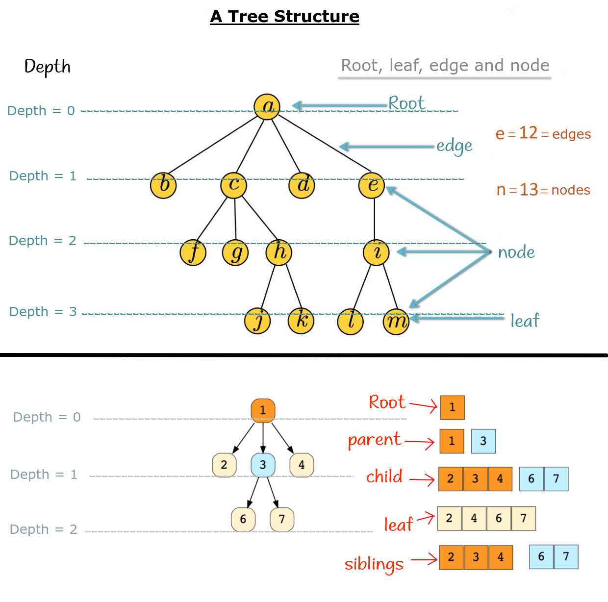


Explanation:

**Definition of a Tree**: A tree is a graph that does not have any cycles.

* Similar to trees in a garden, every tree must have exactly one root - we don't have a tree without a root. Even a tree with a single node becomes its own root (though it is also considered a leaf - explained later).
* **Edge**: Read about edge definitions in graphs; they are more relevant there. In a tree, edges connect the nodes together. Nothing major.
* **Node/Vertex**: We call the circles where we write values as nodes or vertices^_^ Read about the special definitions of graphs to learn more about them.
* **Leaf**: A node that does not have any children is called a leaf.
* **Parent**: A node that has children is the parent for its children.
* **Child**: A node that directly originates from another node is called a child of that node.
* **Sibling**: Nodes that share the same parent are called siblings.
* **Depth**: Depth... I think it refers to the number of edges traversed from the root to reach that particular node. But I've also shown it in the diagram... You'll easily understand what depth means.

**Important Note**: I won't provide further explanations about trees. To learn about trees, it is necessary to study graphs. So, read graphs from discrete mathematics.

_______________________________________________


### Solving n-rooks problem and n-queens problem using the backtracking approach


Okay, let's model the problem using a tree (Decision-tree) and the backtracking approach:

For n = 1, what do we have?
We have a chessboard with only one square:


```
1
```

So constructing its tree is not difficult:
We place a rook on the chessboard at the cell in [0,0], then we check if the placement okay or not. If it is okay, we are done. If not, we backtrack and try again.
It's ok so we keep up^_^


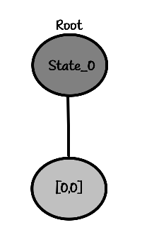
```
"root"
State_0
    └── [0,0]
```

Look at the root, which state did I choose? State 0 - which means S0, which means the starting point, which means when we haven't placed anything yet. You can write it in another way if you want.

_______________________________________________


For n = 2, it becomes a bit more interesting.
Look chessboard and decision-tree my pretties:


```
00
00
```

```
"root"
State_0
```

**Very important note**: In the question I mentioned, there is an implicit point that there is no difference between different rooks or queens. The first rook is considered the same as the second rook, meaning we don't distinguish between them. In the code I provided, you can specify whether there should be a distinction between the pieces or not. Ahm let's explain a bit more: The assumption we made is that, considering these:


```
10
02
```

```
20
01
```

In the two cases above, where in the picture, the blue rook [1] is the first one we placed and the red rook [2] is the second one, in the question, we assumed that there is no difference between them and both represent the same **single answer** below:


```
10
01
```

But we should consider a more general case where we differentiate between the rooks. Because the solutions in this case are more complete and include the solutions in the "indifferent" part as well.

Now let's solve it using backtracking:
We place the first rook in cell [0,0]:


```
10
00
```

The decision tree so far looks like this:


```
root
└── [0,0]
```

Now it's time to place the second rook. According to the order, we placed the first one in [0,0], so we place the second one in [0,1]. So we have:


```
11
00
```

The decision tree becomes like this:


```
root
└── [0,0]
    └── [0,1]
```

And now... we check if it is okay. We see that it is not okay! The rooks are attacking each other. So we backtrack and take a step back (we call it backtracking). We remove the piece we placed and go back to its parent node in the tree and place the next child node - it was not our solution!


```
10
00
```

And the decision tree becomes this again:


```
root
└── [0,0]
```

Just because I deleted the node in the figure, it doesn't mean I should delete it in the code too. It depends on how the programmer implements it; they might say that I want to keep the visited nodes if they don't have a solution so that I know I visited them later... or they might implement a whole different approach...
Anyway, I'll show you the complete tree later; Right now le'ts focus on the algorithm.

Alright, according to the order, we place the next rook at position [1,0], so we have:


```
10
10
```

Decision tree:


```
root
└── [0,0]
    └── [1,0]
```

But... they can attack each other :(
Backtracking again...


```
10
00
```

And it the tree again:


```
root
└── [0,0]
```

Now it's time to place the rook at position [1,1]:


```
10
01✅
```

And here is the decision tree:


```
root
└── [0,0]
    └── [1,1]✅
```


We check, this is one of the possible solutions, so wooohoooo :)
We can print it or save it, whatever we want to do, let's move on to the next step.

We backtrack until the board is empty:


```
00
00
```

And the tree:


```
root
```

_______________________________________________

**I'll say it again!** It's not like we delete the nodes! I do it this way because I'm explaining it hierarchically, so it doesn't get messy and confusing.
- Let's move on.

We placed the first rook in the previous step at [0,0], this time we place it at [0,1] according to the order:


```
01
00
```

And the tree:

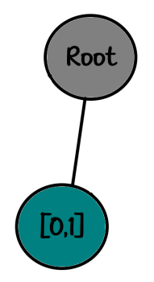
```
root
└── [0,1]
```


I'll quickly go through the steps until the end:

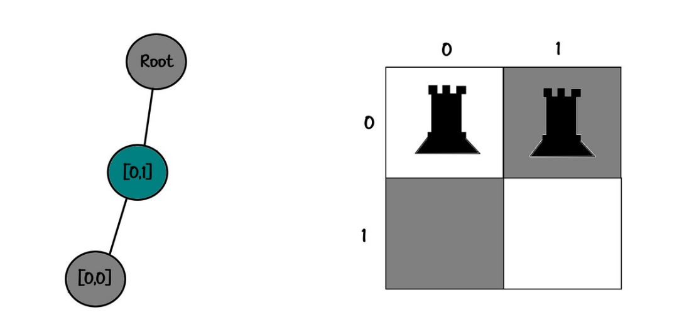
```
Board:
11
00

Tree:
root
└── [0,1]
    └── [0,0]
```

_______________________________________________


```
Board:
01
10✅

Tree:
root
└── [0,1]
    └── [1,0]✅
```

_______________________________________________

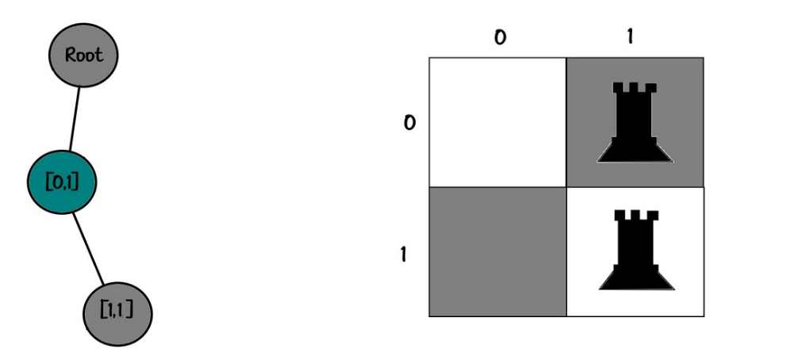
```
Board:
01
01

Tree:
root
└── [0,1]
    └── [1,1]
```

_______________________________________________

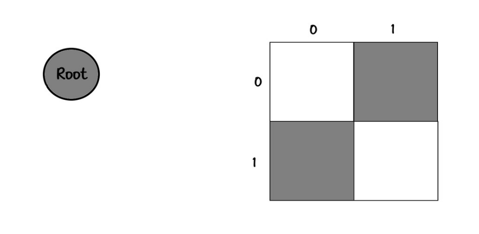
```
Board:
00
00

Tree:
root
```

_______________________________________________

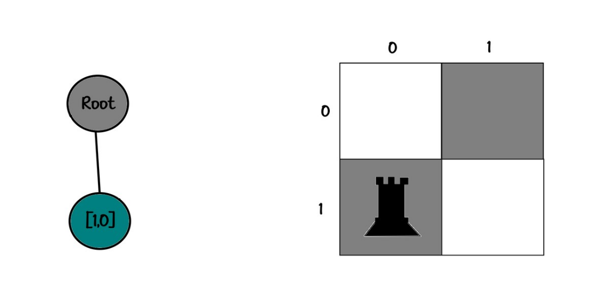
```
Board:
00
10

Tree:
root
└── [1,0]
```

_______________________________________________


```
Board:
10
10

Tree:
root
└── [1,0]
    └── [0,0]
```

_______________________________________________

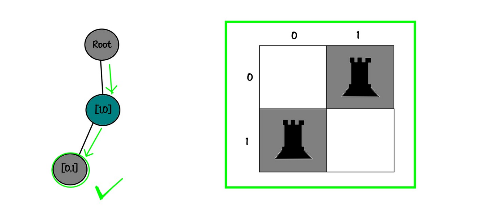
```
Board:
01
10✅

Tree:
root
└── [1,0]
    └── [0,1]✅
```

_______________________________________________


```
Board:
00
11

Tree:
root
└── [1,0]
    └── [1,1]
```

_______________________________________________


```
Board:
00
00

Tree:
root
```

_______________________________________________


```
Board:
00
01

Tree:
root
└── [1,1]
```

_______________________________________________


```
Board:
10
01✅

Tree:
root
└── [1,1]
    └── [0,0]✅
```
_______________________________________________


```
Board:
01
01

Tree:
root
└── [1,1]
    └── [0,1]
```

_______________________________________________

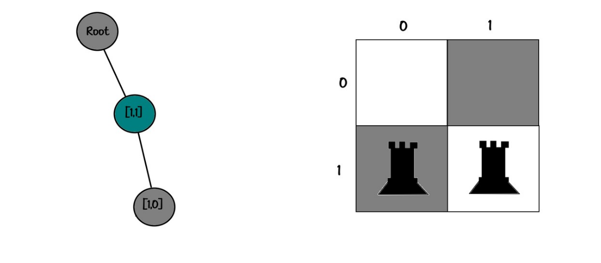
```
Board:
00
11

Tree:
root
└── [1,1]
    └── [1,0]
```

And that's it :)
We found all possible solutions, 4 solutions (with differences):


```
10
02✅

01
20✅

20
01✅

02
10✅
```

And if we don't distinguish between the rooks, we got only:


```
10
01✅

01
10✅
```

_______________________________________________


Okay, now it's time to visualize the decision tree for 2-rooks problem. It's important to observe the tree!

If we distinguish between rooks (which the computer always does and you need to configure it in a way that your output is filtered):
• The first time we have 4 choices
• The second time we have 3 choices (because we can't put one rook on top of another... haha 😋)

In total, gives use 12 different possibilities, as I explained one by one.


```
"root"
├── [0,0]
│   ├── [0,1]
│   ├── [1,0]
│   └── [1,1]✅
├── [0,1]
│   ├── [0,0]
│   ├── [1,0]✅
│   └── [1,1]
├── [1,0]
│   ├── [0,0]
│   ├── [0,1]✅
│   └── [1,1]
└── [1,1]
    ├── [0,0]✅
    ├── [0,1]
    └── [1,0]
```

well, well, well... 

That was backtracking algorithm and detailed explanations...
But,
But,...
A programmer needs to consider many things... They always need to write the most optimized code, what we did before was to put a rook in a specific cell, for example:


```
00
01
```

To block the second rook, only the cell below was not allowed:


```
00
0X
```

And we considered the other cells as allowed, and put a rook in them and check...

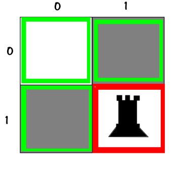
```
VV
VX
```

But is this the right thing to do?
No, ofcourse not!

When we put the first rook here:


```
00
01
```

This lil-rooky can attack in its own row and column (horizontal and vertical direction) – therefore:


```
VX
XX
```

Checking the red cells (X's) is useless and pointless ^_^
With these considerations, I extend and re-create the decision tree like this:


```
"root"
├── [0,0]
│   └── [1,1]✅
├── [0,1]
│   └── [1,0]✅
├── [1,0]
│   └── [0,1]✅
└── [1,1]
    └── [0,0]✅
```

Yup...
It's done :)
If you didn't understand, pause for a moment and try to draw the tree on paper for yourself with the new consideration (about row and column of a rook).
+ I tell ya in secret that it seems our problem's answers for n rooks (and later n queens) are always at the n-th depth of our tree... shhhh, don't tell anyone:3

Okay, now with this new consideration, I draw and analyze the decision tree for n = 1, 2, and 3:

For n = 1, we have:

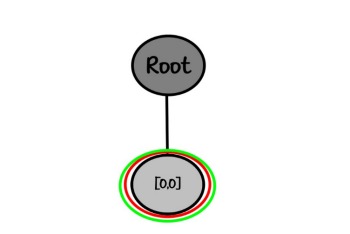
```
"root"
└── [0,0]✅
```

For n = 2, we have:


```
"root"
├── [0,0]
│   └── [1,1]✅
├── [0,1]
│   └── [1,0]✅
├── [1,0]
│   └── [0,1]✅
└── [1,1]
    └── [0,0]✅
```

For n = 3, we have:

I'm tired from drawing so many graphical trees... Although I doubt anyone will read these!
But instead, inspired by the `tree` command in Linux, I wrote a sexy function that visualizes the tree under the terminal:

```
.
└── "root"
    ├── [0,0]
    │   ├── [1,1]
    │   │   └── [2,2]
    │   ├── [1,2]
    │   │   └── [2,1]
    │   ├── [2,1]
    │   │   └── [1,2]
    │   └── [2,2]
    │       └── [1,1]
    ├── [0,1]
    │   ├── [1,0]
    │   │   └── [2,2]
    │   ├── [1,2]
    │   │   └── [2,0]
    │   ├── [2,0]
    │   │   └── [1,2]
    │   └── [2,2]
    │       └── [1,0]
    ├── [0,2]
    │   ├── [1,0]
    │   │   └── [2,1]
    │   ├── [1,1]
    │   │   └── [2,0]
    │   ├── [2,0]
    │   │   └── [1,1]
    │   └── [2,1]
    │       └── [1,0]
    ├── [1,0]
    │   ├── [0,1]
    │   │   └── [2,2]
    │   ├── [0,2]
    │   │   └── [2,1]
    │   ├── [2,1]
    │   │   └── [0,2]
    │   └── [2,2]
    │       └── [0,1]
    ├── [1,1]
    │   ├── [0,0]
    │   │   └── [2,2]
    │   ├── [0,2]
    │   │   └── [2,0]
    │   ├── [2,0]
    │   │   └── [0,2]
    │   └── [2,2]
    │       └── [0,0]
    ├── [1,2]
    │   ├── [0,0]
    │   │   └── [2,1]
    │   ├── [0,1]
    │   │   └── [2,0]
    │   ├── [2,0]
    │   │   └── [0,1]
    │   └── [2,1]
    │       └── [0,0]
    ├── [2,0]
    │   ├── [0,1]
    │   │   └── [1,2]
    │   ├── [0,2]
    │   │   └── [1,1]
    │   ├── [1,1]
    │   │   └── [0,2]
    │   └── [1,2]
    │       └── [0,1]
    ├── [2,1]
    │   ├── [0,0]
    │   │   └── [1,2]
    │   ├── [0,2]
    │   │   └── [1,0]
    │   ├── [1,0]
    │   │   └── [0,2]
    │   └── [1,2]
    │       └── [0,0]
    └── [2,2]
        ├── [0,0]
        │   └── [1,1]
        ├── [0,1]
        │   └── [1,0]
        ├── [1,0]
        │   └── [0,1]
        └── [1,1]
            └── [0,0]
```

_______________________________________________


And it's done :)
By the way, before you do anything:
Writing this function can be a good exercise to test your programming skills.

**Exercise 1:** Write a function that takes a multi-dimensional array and visualizes it as a tree under terminal (like the `tree` or `pstree` commands).

Writing all the classes and functions for n_rook and n_queen took me a whole day, but writing this function to visualize the tree took me 3 days! I'm so rusy I guess... but it was challenging to write it without looking at the source code! You should try it too.

[I will send you the function I wrote at the end of the article]

Now let's move on to some important explanations:
Since PHP is my favorite language, I included a PHP code that I implemented the node as a class and the tree data structure (as a class), using nodes. 
Oh, I forgot to mention, in computer science, a tree is a "Data Structure" like a heap or hash-table or linked-list or stack, etc. (I hope we talk about these in other articles).
Then I used the tree and found all possible solutions using a extended backtracking approach and stored them in the mentioned tree.
This code has an educational aspect. I wanted you to see the generated decision tree. Otherwise, if someone wants to solve this problem properly:

- Firstly, they probably won't use backtracking.
- Secondly, if they do use backtracking, they definitely won't use PHP.
- Thirdly, if they do use php, they won't store the tree in RAM at all! They can't store it! I will prove later that it's impossible! They just perform the algorithm and directly print the result in output buffer.

When it comes to trees, all other languages step back and make way for languages like C and C++. Not because they are older and deserve respect, no :))
It's because they have `pointers`...
Pointers in C-like languages [including c++] are one of the major reason these languages survived so long. It's a very powerful feature... so powerful that along with being object-oriented like C++, allows you to implement your data structure in bitwise form, meaning in the peak of optimization.

I will definitely discuss pointers in detail, in a seprate article.

I did implement a tree data structure in C++ a long time ago, but unfortunately, I don't know where it is :))

Another important point I want to mention here is that with a few changes in the program for n-rook, I also implemented the n-queen problem solver... (again, I emphasize it's not an optimized implementation, it has an educational aspect). Make sure to read it.

Another important point is that with this heavy and unoptimized code, I was able to run it on my system and find the answers fo up to 6 rooks, but it crashed and froze on 7 rooks...! (Let me skip, the story is sad!!!)
You might say to yourself, "Hmm :)) what's so special about 7 rooks that you couldn't handle them :))"
Allow me to explain!

In 7 rooks, we have a 7x7 chessboard so (assuming I optimize backtracking by not putting next rooks in same col/row ⚠️):
- We can place the first rook in 49 squares
- We can place the second rook in 36 squares
- We can place the third rook in 25 squares
- We can place the fourth rook in 16 squares
- We can place the fifth rook in 9 squares
- We can place the sixth rook in 4 squares
- We can place the seventh rook in only one square.

Finally, our tree has 1x4x9x16x25x36x49 leaves, which is 25401600 leaves!!!
Well, that means in the seventh depth, we have exactly 25401600 nodes!
Similarly, in the sixth depth, we also have 25401600 nodes (why? Think about it...)
In the fifth depth, we have 1x4x9x16x25x36 leaves, which is 518400 nodes.
In the fourth depth, we have 1x4x9x16x25 leaves, which is 14,400 nodes.
In the third depth, we have 1x4x9x16 leaves, which is 576 nodes.
In the second depth, we have 1x4x9 leaves, which is 36 nodes.
In the first depth, we have 1x4 leaves, which is 4 nodes.
And finally, in the zeroth depth, which is the root, we naturally have only one node.
So for 7 rooks, our tree has a total of:
25401600 +
25401600 +
518400 +
14400 +
576 +
36 +
4 +
1
nodes.

which is 51336617 nodes..., let's say around 50 million nodes :))

According to my calculations, in this class that I wrote, on average each empty node reserved about 80 bytes of memory from RAM. Let's assume it doesn't reserve more!! :))
51336617 x 80 equals 4106929360 bytes, which is 4010673 megabytes, which is 3916 gigabytes, which is approximately 4 terabytes :)) Do you have 4 terabytes of RAM?!.. I certainly don't!

S to run this, you would need a supercomputer!
And that's just the RAM usage for constructing the tree :))
If you write it in optimized C++ - like really optimizing and all that stuff - and each node becomes 15 bytes... (!!!) it would still occupy 734 gigabytes of memory!!!
So you have two options there:
1. Get a hard-disk and save your tree on it... hahaha! (But then you're runtime takes years and you won't be able to run it with 8 rooks anymore!!! (Why?!) )
2. Skip storing the tree and just traverse and print it.

In both cases, it will have a high runtime.
The n-rook problem is like this because it has many solutions, while the n-queen problem has much fewer solutions, and with this code, you can even run it with tree storage. I leave it up to you.

Don't be surprised by how much resource required by the solutions is growing large...
Everything grows exponentially in these scenarios. To help you understand exponential growth, I'm republishing an old story - please please please read it:3

_______________________________________________


